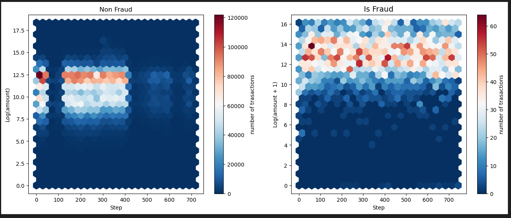

# The Fraud Blocker Company - FBC

The Fraud Blocker Company (FBC) is a company specialized in detecting fraud in financial transactions made through mobile devices. The company has a service called “Blocker Fraud” in which it guarantees the blocking of fraudulent transactions.

The company's business model is of the Service type with the monetization made for the performance of the service provided, that is, the customer pays a fixed fee on the success in detecting fraud in the customer's transactions. In addition, the FBC is expanding and to acquire customers more quickly, it has adopted a very aggressive strategy, FBC will:  

> - Receive 25% of the value of each transaction that is truly detected as fraud (true positives).
> - Receive 5% of the value of each transaction detected as fraud, but the transaction is truly legitimate (false positives).
> - Refund 100% of the value to the customer, for each transaction detected as legitimate, however the transaction is truly a fraud (false negatives).
> - The dataset for this problem is: dataset => https://www.kaggle.com/datasets/ealaxi/paysim1

With this aggressive strategy, the company assumes the risks of failing to detect fraud and is remunerated for assertive fraud detection. For the client, it is an excellent business to hire the FBC. Although the fee charged is very high on success, 25%, the company reduces its costs with fraudulent transactions correctly detected and the damage caused by an error in the anti-fraud service will be covered by the FBC itself.

For FBC, in addition to getting many customers with this risky strategy to guarantee reimbursement in the event of a failure to detect customer fraud, it depends only on the precision and accuracy of the models built by its Data Scientists, that is, the greater the precision of “Fraud Blocker” model, the greater the company's revenue. However, if the model has low precision, the company could have a huge loss.

## About the dataset
- We have Number of rows: 6362620  rows and 11 columns;
- Fraud: 8213 and Non-Fraud: 6354407;
- Highly skewed data (and kurtosis too);

## Data Filtering

- Use lnp.log( ) to verify possible outliers between the "amount" and "step" columns;
- Highly concentrated in CASH_IN / CAS_OUT / PAYMENT in "type" column;
- Data filtered using IQR on "step" and "amount";

## Feature Engineering
Features to create:
- `transaction_direction`: (C2C,C2M,M2M,M2C)
- `hour`: equivalent to STEP
- `orig_type` (customer or machine)
- `dest_type` (customer or machine)
- `old_balance_orig_status` (zero or non zero)
- `new_balance_orig_status` (zero or non zero)
- `old_balance_dest_status` (zero or non zero)
- `new_balance_dest_status` (zero or non zero)
- `is_orig_old_balance_greater_new` (yes or no)
- `is_dest_old_balance_greater_new` (yes or no)
- `is_orig_equal_dest` (yes or no)

## Univariate Analysis
> Part1

- AMOUNT higher concentration: between 59873.14 and 442412.39
- Origin old balance minor concentration: between 8102.08 and 162753.79
- Origin new balance minor concentration: between 98714.77 and 442412.39
- Destination old balance minor concentration: between 268336.29 and 1982758.26
- Destination new balance minor concentration: between 268336.29 and 1982758.26

> Part2

- Cash-out and payment represent the major part of the total transactions.
- The great majority of the transactions are not flagged as fraud.
- There is only one type of origin: customer.
- There are more transactions whose destination is customer.
- The origin old balance status is non zero for the majority of transactions.
- There are more transactions whose the origin new balance status is zero.
- There are more transactions whose the destination old balance status is non zero.
- There are more transactions whose the destination new balance status is non zero.
- No transactions has the the same origin as destination.
- There are more transactions whose origin old balance is higher than the new.
- The destination old balance is higher than the new for the majority of the transctions.
- The transaction direction C2C is almost the double of C2M.

## Hipothesis Created
> Transaction Type
1. Payment represent 50% of the total fraudulent transactions.
2. Transfer represent 50% of the total non fraudulent transactions.

> Transaction Direction
1. Customer to Machine represent at least 50% of the total fraudulent transactions.
2. Customer to Customer represent at least 50% of the total non fraudulent transactions.

> Transaction Destination
1. Machine destination represents 40% of the total fraudulent transactions.
2. Customer destination represents 40% of the total non fraudulent transactions.
3. Destination non zero new balance represents 50% of the total fraudulent transactions.

> Transaction Origin
1. Origin non zero old balance represents 80% of the total fraudulent transactions.
2. Origin zero new balance represents 40% of the total fraudulent transactions.

> Flagged as fraud
1. At least 95% of the total fraudulent transactions are flagged as fraud.
2. At least 20% of the total non fraudulent transactions are flagged as fraud.

## Hipothesis Evaluated
| ID  | Hypothesis                                                                                 | Conclusion |
|:-----:|:-----------------------------------------------------------------------------------------|:------------|
| H1  |Payment represent 50% of the total fraudulent transactions.                                 | FALSE|
| H2  |Transfer represent 50% of the total non fraudulent transactions.                            | FALSE|
| H3  |Customer to Merchant represent at least 50% of the total fraudulent transactions.           | FALSE|
| H4  |Customer to Customer represent at least 50% of the total non fraudulent transactions.       | TRUE|
| H5  |Merchant destination represents 40% of the total fraudulent transactions.                   | FALSE|
| H6  |Customer destination represents 40% of the total non fraudulent transactions.               | FALSE|
| H7  |Destination non zero new balance represents 50% of the total fraudulent transactions.       | TRUE|
| H8  |Origin non zero old balance represents 80% of the total fraudulent transactions.            | FALSE|
| H9  |Origin zero new balance represents 40% of the total fraudulent transactions.                | FALSE|
| H10  |At least 95% of the total fraudulent transactions are flagged as fraud.                    | FALSE|
| H11  |At least 20% of the total non fraudulent transactions are flagged as fraud.                | FALSE|

## Multivariate analysis

> Key points:
- amount and new_balance_dest: modearate positive correlation
- old_balance_orig and new_balance_orig: perfect positive correlation
- old_balance_dest and new_balance_dest: very strong positive correlation

## Sample Amount
To make a right sampling we need:

- Keep the classes proportions
- Get a statistically significant sample size

Let's use the following parameters:

- **Population size:** 6,260,531 (that's the full data set size)
- **Confidence level:** 95% (that's industry standard)
- **Margin of error:** 0.1%

Making the calculations with these parameters it gives us a sample size of 832,665. Let's round up to 1,000,000 to make our lives easier.

More info at: https://www.surveymonkey.com/mp/sample-size-calculator/

## Pre-processing
- **MinMaxScaler**: "step","amount","oldbalanceOrg","newbalanceOrig","oldbalanceDest","newbalanceDest"
- **Categorical Encoding**: "orig_type","dest_type", "transaction_direction"
- **Frequency Encoding**: "type","nameOrig","nameDest"
- **Binary Encoding**: "old_balance_orig_status","new_balance_orig_status","old_balance_dest_status","new_balance_dest_status","is_orig_equal_dest","iis_orig_old_balance_greater_new","iis_dest_old_balance_greater_new"

## Feature Selection
- Tested with Boruta: ['step','amount','oldbalanceOrg','newbalanceOrig','oldbalanceDest','newbalanceDest','type','new_balance_orig_status','old_balance_dest_status','new_balance_dest_status']

## Train/Test Split
- 30% to TEST
- TRAIN was balanced with **SMOTETomek**

## Model

classifiers_tested.PNG

- Verify Brier Loss: (XGBoost): 0.001572 and  (CatBoost): 0.0025128

## Tuning

## Calibration

## Cross-Validation - all performed models
|Model 	| Precision	|Recall	| F1-Score | Cohen-Kappa|
|:------:|:--------:|:-----:|:--------:|:---------:|
XGBClassifier | 0.9797 +/- 0.0045 | 0.9427 +/- 0.0067 | 0.9608	+/- 0.0034 | 0.9605	+/- 0.0034|
Tuned XGBClassifier | 0.9762 +/- 0.0072 | 0.9453 +/- 0.0092 | 0.9605 +/-0.0046 | 0.9601 +/- 0.0047|
Calibrated XGBClassifier | 0.9722 +/- 0.0022 | 0.9573 +/- 0.0056 | 0.9646 +/- 0.0023 | 0.9644 +/- 0.0023 |

- It was tested with 10 folds

## Business Performance
 With 6354407 transactions (Fraud = 8213 and Non-Fraud = 6362620):

- Receive **25%** of the value of each transaction that is truly detected as fraud (true positives).
- Receive **5%** of the value of each transaction detected as fraud, but the transaction is truly legitimate (false positives).
- Refund **100%** of the value to the customer, for each transaction detected as legitimate, however the transaction is truly a fraud (false negatives).

> Considering the parameters:
- Median amount of a transaction: **$74,871.94** (we're using the median because the amount distribution is highly skewed);
- Portfolio: **6,362,620** transactions (fraudulent + non fraudulent)

- TP amount = 0.25 * median_amount * TP_transactions;
- FP amount = 0.05 * median_amount * FP_transactions;
- FN amount =  median_amount * FN_transactions;

 - Gross Value = TP amount + FP amount - FN amount

- **Best Scenario: `$1,007,761,121.63`**
- **Worst Scenario: `$1,265,581,592.83`**
